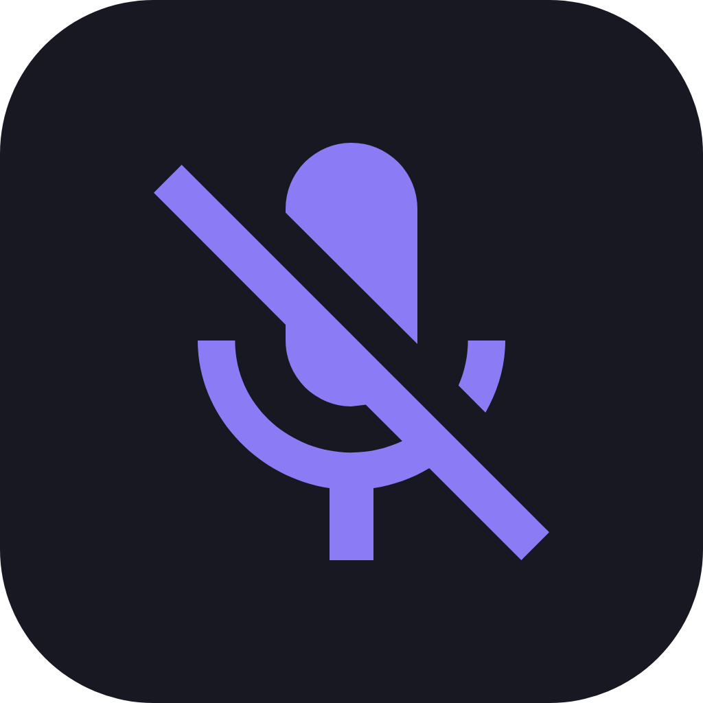

  

<h1 align="center">MuteGuard</h1>

  A small, event-driven microphone mute utility for Windows meetings.

MuteGuard is a deliberately subtractive fork of
[silence!](https://github.com/vertopolkaLF/silence). It keeps the Rust,
Dioxus, Core Audio, global-hotkey, tray, and native-overlay foundation while
removing unrelated audio management and background monitoring.

## What it does

- Toggles the default communications microphone (falling back to the console
  default) or every active capture endpoint.
- Supports multiple global keyboard and mouse hotkeys, including single keys,
  modifier-only bindings and arbitrary simultaneous keyboard chords such as
  `A+B` or `Win+Shift+A`, without requiring `Ctrl`.
- Optionally ignores modifier keys for an individual binding.
- Shows muted/unmuted state in the tray and in a configurable click-through
  overlay.
- Offers multi-monitor overlay selection, a nine-anchor position picker, scale,
  icon/dot/text, exact editable overlay/tray icon color, opacity, background,
  border, and temporary after-toggle visibility settings. Overlay scale 100%
  uses the new compact baseline (85% of the previous geometry).
- Uses a `#131313` dark overlay background and provides a unified MuteGuard
  color studio with live HSV tuning, RGB feedback, exact HEX validation and
  presets. Preview movement stays local and configuration is saved on commit.
- Lets the Settings interface follow the Windows accent or use a custom accent
  selected in General.
- Shows one synchronized overlay on every selected monitor and keeps each one
  inside that monitor's usable work area, clear of the taskbar and at least 10
  px from every available screen edge.
- Can start with Windows and mute once the default meeting microphone becomes
  available during background-process startup.
- Keeps Settings in a separate process so closing it releases WebView
  resources.

Left-clicking the tray icon opens Settings. Its right-click menu can mute or
unmute the microphone, open Settings, or exit MuteGuard.

## Runtime model

Core Audio is the state authority:

    user action
      -> GetMute
      -> SetMute
      -> IAudioEndpointVolumeCallback::OnNotify
      -> GetMute
      -> tray + overlay

MuteGuard does not optimistically update its UI after SetMute. A Core Audio
notification causes the authoritative state read. Endpoint notifications
rebind that callback when the Windows default capture endpoint changes.

For an “all microphones” toggle, the default microphone determines the target
direction and active capture endpoints are enumerated only for that user
action.

There is no recurring configuration, device, session, process, microphone-use,
gamepad, or inactivity polling. Timers are limited to finite overlay
transitions, temporary overlay dismissal, startup-mute retry, release
reconciliation for global hotkeys, and
tray restoration after an Explorer failure.

## Configuration

Configuration is stored at:

    %APPDATA%\MuteGuard\config.json

On first use, MuteGuard can read the previous
%APPDATA%\SilenceV2\config.json. Only compatible toggle hotkeys and settings
are migrated; gamepad bindings, force actions, device-specific targets,
sounds, and other removed features are discarded.

Saving Settings sends an explicit native message to the background process.
The background process does not watch the file modification time.

If the configuration is invalid, Settings offers an explicit recovery action.
The invalid file is preserved as a timestamped backup before defaults are
written. Audio, configuration, process-launch, and notification-registration
errors are also surfaced through the Settings window or a native tray alert.

## Build

Requirements:

- Windows 10 or Windows 11
- Rust 1.98 or newer
- the x86_64-pc-windows-msvc target for a native Windows build
- Dioxus CLI when producing a desktop bundle
- WebView2 Runtime for the Settings window

Development checks:

    cargo fmt --check
    cargo check --locked
    cargo clippy --locked --tests -- -D warnings

Build the application:

    dx build --platform windows --release --target x86_64-pc-windows-msvc

build.ps1 creates x64, x86, and arm64 portable archives and NSIS installers
under dist\<version>.

### Reproducible Windows x64 build in Docker

The checked-in Docker image definition contains Rust 1.98, the Windows GNU
target and linker, rustfmt, Clippy, Dioxus CLI 0.7.6, and NSIS:

    docker build --network default \
      --file docker/Dockerfile.windows-gnu \
      --tag muteguard-builder:rust-1.98-dx-0.7.6 .

Network access is needed only while creating the image. Mount the repository
and use `--network none` for project checks and builds. After the image and
named Cargo/target volumes have been prepared, the verified offline commands
are:

    cargo fmt --check
    cargo clippy --offline --locked --tests \
      --target x86_64-pc-windows-gnu -- -D warnings
    cargo test --offline --locked --no-run \
      --target x86_64-pc-windows-gnu
    dx build --desktop --release \
      --target x86_64-pc-windows-gnu --frozen

Dioxus CLI 0.7.6 currently passes MSVC linker flags when `dx build --windows`
is combined with the GNU target. The cross-build therefore uses the desktop
platform while `build.rs` embeds the Windows icon and version resource in the
same Dioxus-built executable that references the packaged assets.

The complete Windows x64 package pipeline is:

    .\build-docker.ps1

It performs an offline Dioxus release build, assembles the portable directory,
adds the WebView2 loader and legal notices, creates the ZIP, and compiles the
current-user NSIS installer. The installer detects the Microsoft Edge WebView2
Runtime and offers the official Evergreen bootstrapper when it is absent.
Mute hotkeys, tray controls, and the native overlay do not depend on WebView2;
only Settings does.

## Scope

MuteGuard intentionally has no volume control, output/input switching,
per-process microphone-use detection, sounds, hold actions, force mute/unmute,
inactivity automation, controller support, or updater.

## Attribution and license

MuteGuard is based on silence! by vertopolkaLF and retains the upstream Apache
License 2.0. See [LICENSE](LICENSE) and
[THIRD_PARTY_NOTICES.md](THIRD_PARTY_NOTICES.md).
